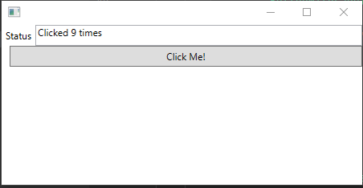

# nac.wpf.forms

+ Library to build WPF GUI apps quickly

+ nuget package [`nac.wpf.forms`](https://nuget.org/)

## Examples

### Simple form with a button

+ ```c#
  var form = new Form();
  int clickCount = 0;
  form
    .TextBoxFor("Status")
    .ButtonWithLabel("Click Me!", (sender, args) =>
                     {
                         form.Model["Status"] = $"Clicked {++clickCount} times";
                     })
    .Display();
  ```

+ 
+ 
